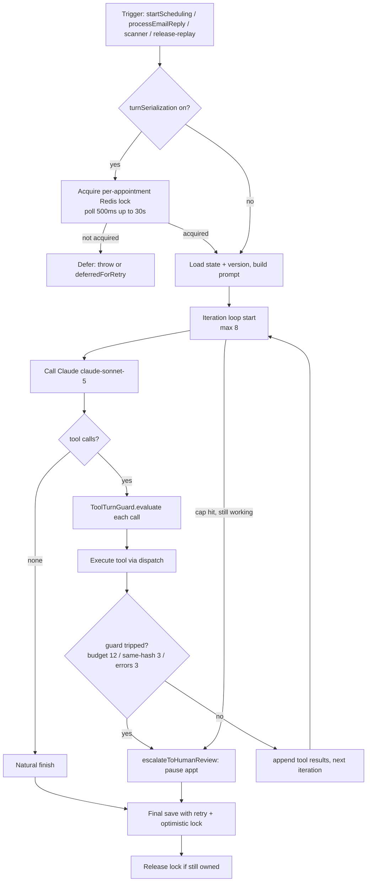
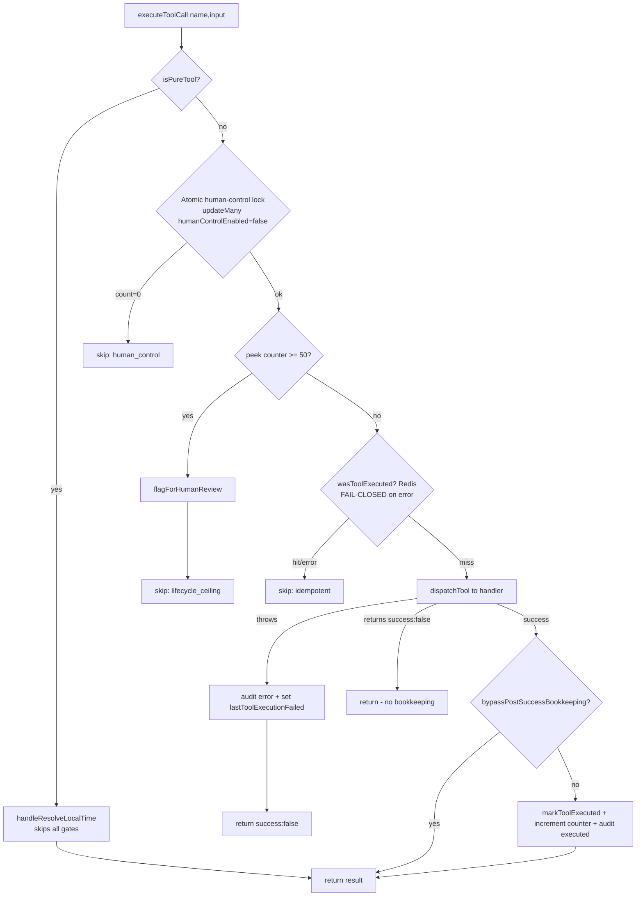
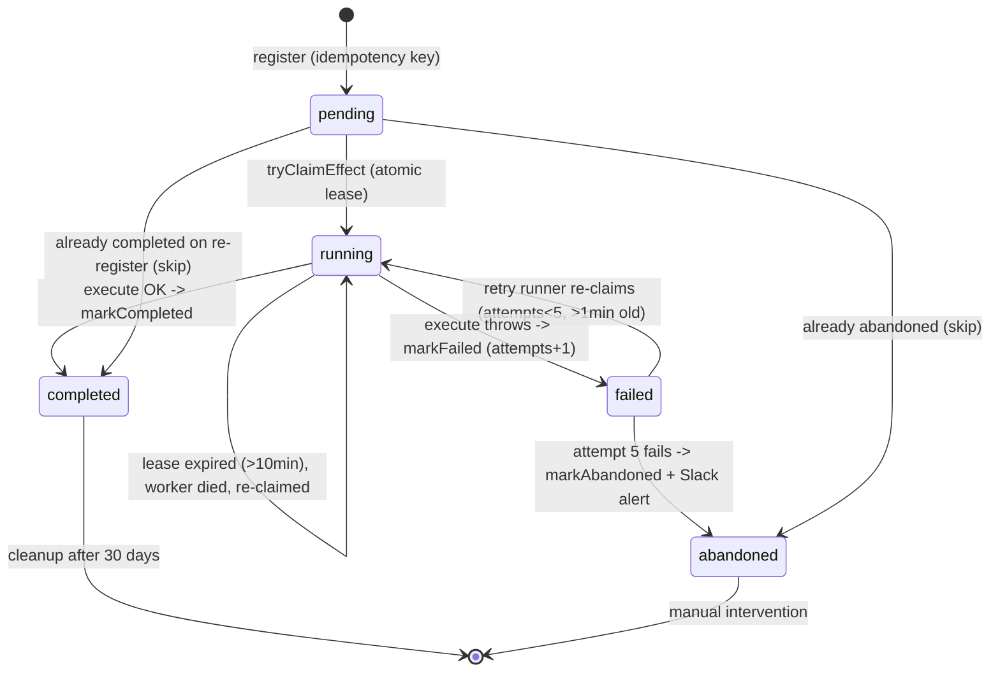
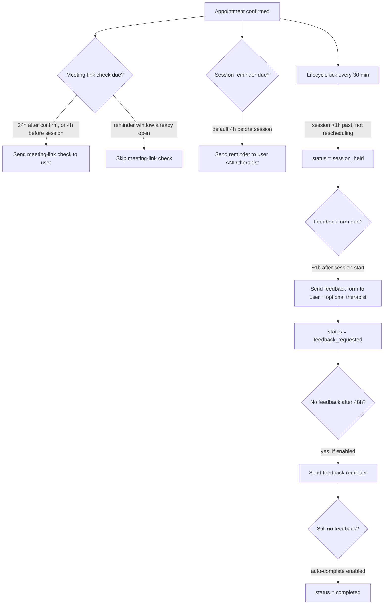
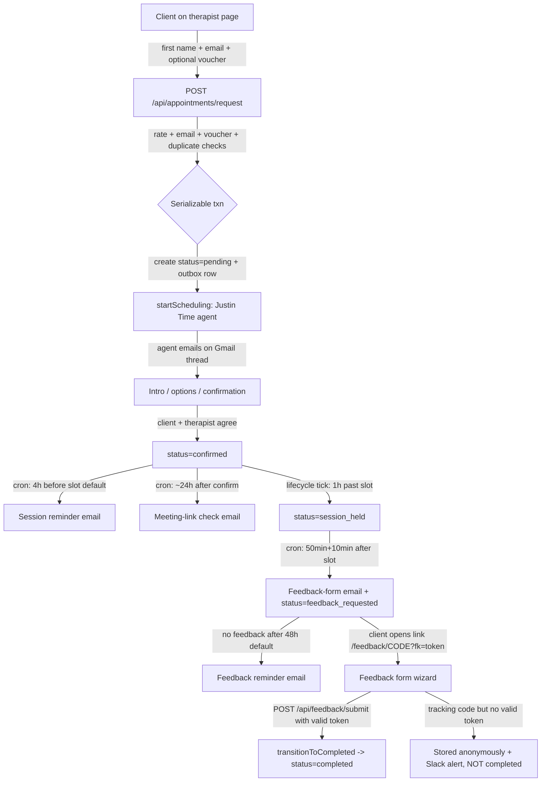
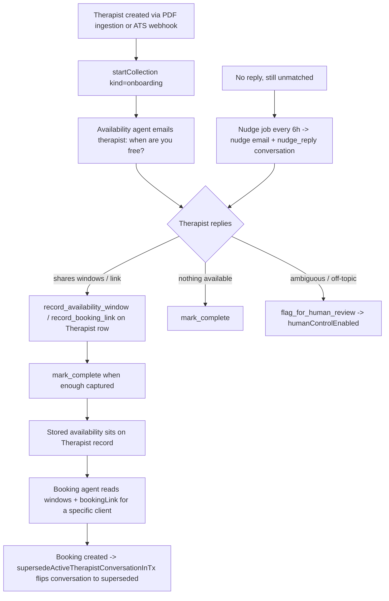
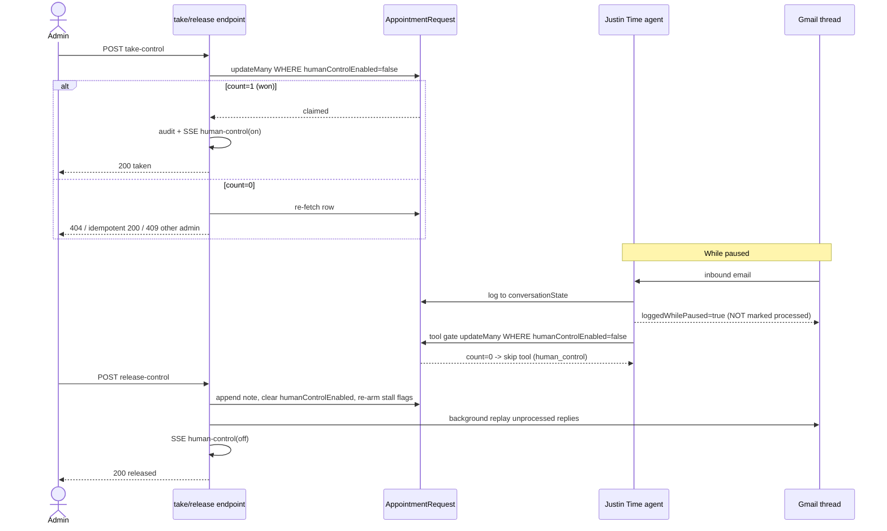
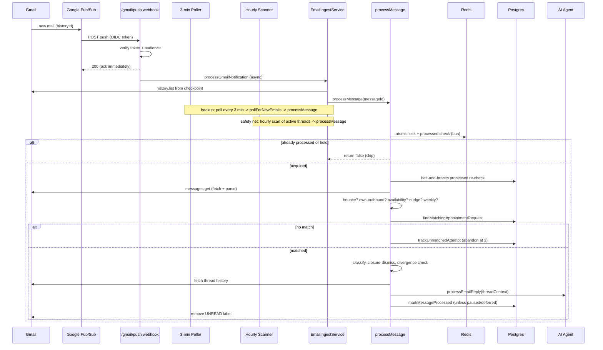
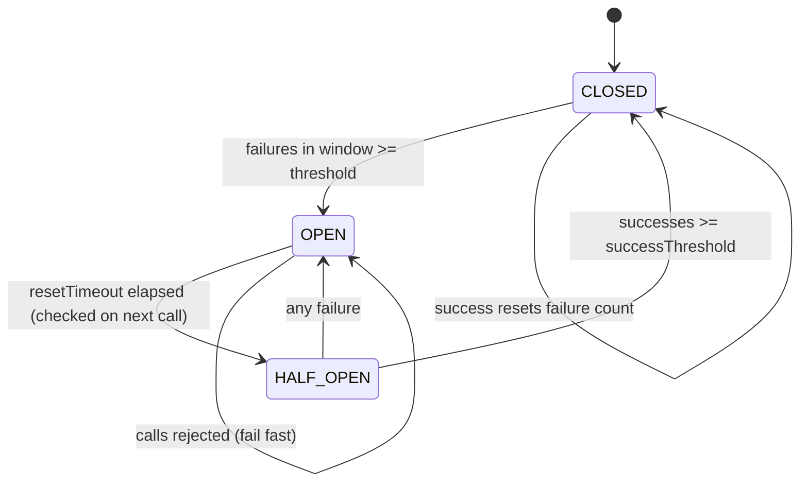

# Therapist Scheduler — Application Runbook

> **What this is.** A single, accessible guide to how the Therapist Scheduler
> actually works and how to operate it. It focuses on the three things that
> matter most day to day — the **AI agent harness**, the **appointment
> lifecycle**, and the **user journeys** (client, therapist, admin) — and then
> explains the **key pieces of logic** the whole system leans on.
>
> **How it was built.** Every fact here was read out of the live source in
> `packages/backend` and `packages/frontend` and independently fact-checked
> against the code. Where the older `README.md` or `docs/` disagree with the
> code, **the code wins** — those documents can lag behind. File references
> look like `path/to/file.ts:123` so you can jump straight to the source.
>
> **Accessibility.** Every diagram is followed by a plain-text description
> (“**In words:** …”) so the runbook is usable without seeing the picture.
> Terms are defined the first time they appear.

---

## Contents

1. [The system in one picture](#1-the-system-in-one-picture)
2. [The agent harness](#2-the-agent-harness)
3. [The appointment lifecycle](#3-the-appointment-lifecycle)
4. [User journeys](#4-user-journeys)
5. [Key elements of logic](#5-key-elements-of-logic)
6. [Operations](#6-operations)
7. [Glossary](#7-glossary)

---

## 1. The system in one picture

Therapist Scheduler coordinates therapy appointments **entirely over email**.
A client fills in a short public form; from there an AI agent (nicknamed
**“Justin Time”**) emails the client and the therapist, negotiates a time,
confirms it, and — after the session — collects feedback. A human admin
watches the whole thing on a real-time dashboard and can take over any
conversation at any moment.

There are **two distinct AI agents**, and keeping them straight is essential:

| Agent | Job | Works on | Entry code |
|-------|-----|----------|------------|
| **Booking agent** (“Justin Time”) | Negotiates and confirms a specific slot for a specific client | `AppointmentRequest` rows | `services/justin-time.service.ts` |
| **Availability agent** | Asks a therapist when they’re free and records it | `TherapistConversation` rows | `domain/scheduling/availability/agent/service.ts` |

They never talk to the same person at the same time: the moment a real booking
is created, the therapist’s availability conversation is **superseded**.

### Architecture

- **`packages/backend`** — Fastify + TypeScript API. Prisma/PostgreSQL is the
  system of record; Redis provides caching, distributed locks, and dedup;
  Claude is the agent brain; Gmail is the transport; Slack is the alert
  channel; BullMQ is the outbound email queue.
- **`packages/frontend`** — React + Vite admin dashboard **and** the public
  booking / feedback pages.
- **`packages/shared`** — types and constants shared by both (including the
  appointment status enum, the single source of truth for lifecycle states).

### The mental model that explains almost everything

Three ideas recur throughout the codebase. Hold these and the rest falls into
place:

1. **Email is unreliable, so everything is “at-least-once with dedup.”** The
   same inbound email can arrive three ways (push, poll, scanner); the same
   side effect can be attempted twice. The system leans on idempotency keys,
   Redis locks, database preconditions, and “sentinel” timestamps so that
   duplicates collapse to a single effect. See §5.
2. **The appointment status is sacred.** Exactly one small module is allowed to
   change it, always atomically, always with an audit trail. See §3.
3. **A human can seize control at any instant.** “Human control” is an atomic
   flag that pauses the agent mid-flight. It is the operator’s main lever. See
   §4.3.

---

## 2. The agent harness

The *harness* is the machinery around Claude: what starts an agent “turn,” how
tools are run safely, how the agent is instructed, and how its memory works.

### 2.1 What is a “turn”?

A **turn** is one complete run of the agent in response to a single trigger.
During a turn the code calls Claude, runs whatever tools Claude asks for, feeds
the results back, and repeats until Claude stops asking for tools or a safety
guard trips.

There are exactly **four triggers**, and all of them funnel into
`JustinTimeService`:

| Trigger | Entry point | Notes |
|---|---|---|
| A brand-new booking | `startScheduling()` — `justin-time.service.ts:85` | Fired once after the appointment row commits |
| An inbound email reply | `processEmailReply()` — `justin-time.service.ts:258` | The normal case |
| The hourly missed-message scanner | `missed-message-scanner.service.ts:139` | Safety net for lost emails |
| An admin releasing human control | `routes/admin/appointments/human-control.ts:53` | Replays messages that arrived while paused |

### 2.2 One turn, end to end

> **In words:** A trigger starts the turn. If per-appointment turn
> serialization is enabled, the code first tries to grab a Redis lock (polling
> every 500 ms for up to 30 s); failing that, the turn is deferred for later.
> Otherwise it loads the conversation state (with a version number for
> optimistic locking) and builds the system prompt. It then loops up to **8**
> times: call Claude (`claude-sonnet-5`), and if Claude asks for no tools, the
> turn finishes naturally. If it asks for tools, each is checked by the
> `ToolTurnGuard` and run through the dispatch pipeline. If any guard trips
> (tool budget 12, same-arguments abort 3, or 3 tool errors) the appointment is
> paused for a human. Otherwise results are fed back and the loop continues;
> hitting the iteration cap while still working also pauses. Finally the state
> is saved (with retry, under optimistic locking) and the lock released.

Key constants — `services/agent-tool-loop.ts`:

| Constant | Value | Meaning |
|---|---|---|
| `MAX_TOOL_ITERATIONS` | **8** | Claude round-trips per turn (bounds API spend) |
| `TURN_TOOL_BUDGET` | **12** | State-changing tool calls per turn (pure tools exempt) |
| `SAME_HASH_TURN_ABORT` | **3** | Identical tool+args: 1st runs, 2nd soft-blocked, 3rd aborts the turn |
| `TURN_ERROR_LIMIT` | **3** | Tool failures in a turn before the error circuit-breaker trips |
| Agent model | `claude-sonnet-5` | Booking + availability agents (`config/models.ts:29`) |

### 2.3 The four per-turn guards

Four independent guards can stop a runaway turn. **Any one of them pauses the
appointment for a human** (via `flagForHumanReview`, which flips
`humanControlEnabled` to true):

1. **Tool budget** — at most 12 state-changing tool calls in a turn.
2. **Same-hash abort** — the identical tool call (same name + arguments) three
   times aborts the turn. This catches a model stuck in a loop.
3. **Iteration cap** — 8 Claude round-trips. Reaching it while still working
   escalates; a *natural* finish on the 8th does not.
4. **Error circuit-breaker** — 3 tool errors in one turn escalates.

There is also a **cross-turn backstop** the per-turn guards can’t see:
`PER_APPOINTMENT_LIMIT = 50` successful state-changing tool calls over an
appointment’s **entire life** (`constants.ts:447`, enforced in
`dispatch.ts:136`). Hitting it pauses the appointment with the reason
**“Tool execution ceiling reached.”**

> **Operator note.** When a guard trips, inbound email is still *logged* but the
> agent is skipped until a human releases control. See §4.3 for how to release —
> and note that ceiling trips need their Redis counter reset on release, which
> only the **bulk** release endpoint does automatically.

### 2.4 The tool catalog (14 tools)

Each tool the booking agent can call is defined once as a schema
(`domain/scheduling/agent/tools-schema.ts`, what Claude sees) and implemented
once as a handler (`domain/scheduling/agent/handlers/`, what runs).

| Tool | What it does | Notes |
|---|---|---|
| `resolve_local_time` | Convert wall-clock + timezone + duration → exact ISO start/end, DST-safe | **Pure/read-only** — bypasses all gates |
| `send_email` | Email the client **or** therapist of this appointment | Carries a `purpose` that drives the conversation stage |
| `update_therapist_availability` | Write the therapist’s **recurring weekly** schedule | Therapist-inbound only |
| `mark_scheduling_complete` | Confirm the booking, send confirmations, freeze the therapist | Drives `confirmed` |
| `cancel_appointment` | Cancel + release the therapist | Drives `cancelled` |
| `recommend_cancel_match` | User declined the therapist (didn’t ask to cancel) → hand to admin | Sets closure-recommendation fields |
| `initiate_reschedule` | Clear the confirmed time so a new one can be arranged | Refuses >1 h past the session |
| `flag_for_human_review` | Agent admits uncertainty → pause + Slack alert | Stops the loop |
| `issue_voucher_code` | Generate a session voucher + booking URL | *Informational* (see below) |
| `remember` | Store a short thread note (≤280 chars, ≤20 notes, deduped) | *Informational* |
| `record_booking_link` | Save the therapist’s Calendly/Acuity link | *Informational* |
| `record_availability_window` | Capture a one-off availability window | *Informational* |
| `record_user_timezone` | Persist the client’s IANA timezone | *Informational* |
| `record_therapist_timezone` | Persist the therapist’s IANA timezone | *Informational* |

The six **informational** tools set `bypassPostSuccessBookkeeping` — they do
**not** count against the per-appointment ceiling and aren’t written to the
Redis idempotency layer (`dispatch.ts:246`). If you’re debugging “why did this
appointment hit the 50-call ceiling,” these calls are invisible to that counter
by design.

### 2.5 The dispatch pipeline — the gates every tool call passes

`executeToolCall` (`dispatch.ts:84`) is the single funnel for all tool calls.
Understanding its **order** is the key to reasoning about why a tool did or
didn’t take effect.

> **In words:** First, is the tool pure (read-only)? Pure tools
> (`resolve_local_time`) skip every gate. Otherwise: **Gate 1** is an atomic
> human-control lock — an `updateMany` requiring `humanControlEnabled = false`;
> if a human took control, it matches 0 rows and the tool is skipped. **Gate 2**
> peeks the per-appointment counter; at 50+, it flags for human review and
> skips. **Gate 3** is a Redis idempotency check that **fails closed** (a hit or
> *any* Redis error causes an idempotent skip). On a miss the handler runs
> inside try/catch: a thrown error is audited and returns `success:false`; a
> handler that returns `success:false` (bad input or a security block) returns
> without bookkeeping so the agent can retry. On success, unless the tool is
> informational, the idempotency key is written, the counter incremented, and an
> “executed” audit row saved.

Two facts here are the most operationally important in the whole system:

- **Idempotency fails *closed* (`idempotency.ts:61`).** If Redis is **down**,
  every state-changing tool call is skipped as “idempotent,” so the agent
  effectively stops acting. It resumes cleanly on the next inbound email once
  Redis recovers. Log symptom: *“Redis unavailable for idempotency check —
  failing closed.”*
- **The per-appointment counter fails *open* (`appointment-tool-counter.ts:42`).**
  A Redis flap will *not* trip the 50-ceiling; the per-turn guards are the
  fallback there.

**Security gates inside handlers** (defence against prompt injection in inbound
email):

- `send_email` recipient must equal the appointment’s client or therapist
  address; anything else is rejected and never sent (`send-email.ts:110`).
- `issue_voucher_code` always sends to `context.userEmail`, ignoring any
  address the model supplies (`issue-voucher-code.ts:39`).
- `update_therapist_availability` only runs when the inbound email is from the
  therapist (`update-therapist-availability.ts:44`).
- A second, deeper check re-verifies human-control **and** non-terminal status
  atomically right before the actual Gmail send (`send.ts:118`), catching an
  admin who cancels or takes over mid-turn.

### 2.6 How the agent is instructed (the system prompt)

The prompt is **rebuilt from scratch every turn** by
`buildSystemPrompt()` (`system-prompt-builder.ts:104`) — never cached — so the
agent always sees the latest database state. If you’re asking *“why did the
agent say/do that?”*, the answer is almost always in the prompt assembled for
that turn.

It stitches together:

- **Persona & tone** — the agent’s name (`agent.fromName` setting), role
  (Scheduling Coordinator), from-address (`scheduling@spill.chat`), spelling
  (`agent.languageStyle`), and one of three tone blocks (`agent.toneStyle`:
  formal / warm-casual / friendly). These are **admin settings, not code**.
- **Stage-specific workflow** — different instructions depending on whether the
  therapist’s availability is already known and whether the client booked via a
  `direct_link`.
- **Admin knowledge base** — free-text rules/FAQs, split by audience, fetched
  with a 5-second timeout and **screened for prompt injection** before
  injection (`system-prompt-builder.ts:659`).
- **Timezones & date anchoring** — today’s date plus each party’s timezone, with
  pre-computed conversions so the agent doesn’t do timezone math itself.
- **Three memory layers** (below).
- **The current stage** — a short “here’s what to do next” block from the
  conversation checkpoint.

### 2.7 The three memory layers

| Layer | What | Scope | Source |
|---|---|---|---|
| **A — Auto-extracted facts** | Regex-scraped times, selections, confirmations, blockers | This booking | `utils/conversation-facts.ts` |
| **B — Agent thread notes** | Soft notes the agent writes via `remember` (≤20, ≤280 chars) + ad-hoc windows (≤30) | This booking (primary-key scoped) | `agent-notes-store.ts`, `agent-memory.service.ts` |
| **C — Cross-booking profiles** | Durable notes about a client/therapist across all their bookings (≤10) | Across bookings | `agent-profile.service.ts` |

> **Operator notes.** Layer A is heuristic — treat the “facts” block as a hint,
> not ground truth. Layer B is strictly per-appointment (no leakage between two
> bookings for the same person). Layer C is **admin-written only** in the
> current phase — there is no automatic cross-booking memory yet, so don’t
> expect the agent to “remember” a returning client on its own.

### 2.8 Conversation checkpoints (stages)

A **checkpoint** records where a booking is in the flow. It drives the prompt’s
“current stage” block, stall detection, and which party gets chased. Stages
(`conversation-checkpoint.service.ts:88`): `initial_contact`,
`awaiting_therapist_availability`, `awaiting_user_slot_selection`,
`awaiting_therapist_confirmation`, `awaiting_meeting_link`, `confirmed`,
`rescheduling`, `cancelled`, `stalled`, `chased`, `closure_recommended`.
Illegal stage transitions are **logged, not blocked** (a `WARN` is a
recovery/edge-case signal, not necessarily a bug).

---

## 3. The appointment lifecycle

Every appointment is one row in `appointment_requests` whose `status` column
moves through **eight** states. The lifecycle module
(`domain/scheduling/lifecycle/`) is the **single source of truth** — the only
sanctioned way to change status.

### 3.1 The state machine

```mermaid
stateDiagram-v2
    [*] --> pending
    pending --> contacted: transitionToContacted (agent)
    pending --> negotiating: transitionToNegotiating
    contacted --> negotiating: transitionToNegotiating
    pending --> confirmed: transitionToConfirmed
    contacted --> confirmed: transitionToConfirmed
    negotiating --> confirmed: transitionToConfirmed
    confirmed --> confirmed: reschedule (new datetime)
    confirmed --> session_held: transitionToSessionHeld (30min tick, +1h buffer)
    session_held --> feedback_requested: transitionToFeedbackRequested (system)
    confirmed --> feedback_requested: transitionToFeedbackRequested (admin back-fill only)
    session_held --> completed: transitionToCompleted
    feedback_requested --> completed: transitionToCompleted
    confirmed --> completed: complete without feedback
    pending --> cancelled: transitionToCancelled
    contacted --> cancelled: transitionToCancelled
    negotiating --> cancelled: transitionToCancelled
    confirmed --> cancelled: transitionToCancelled
    session_held --> cancelled: transitionToCancelled
    feedback_requested --> cancelled: transitionToCancelled
    completed --> [*]
    cancelled --> [*]
    note right of completed: terminal (serializable + FOR UPDATE)
    note right of cancelled: terminal; reachable from any state EXCEPT completed
```

> **In words:** The forward line is `pending → contacted → negotiating →
> confirmed → session_held → feedback_requested → completed`. There are legal
> shortcuts: `pending` can jump straight to `negotiating` or `confirmed`;
> `confirmed` can loop to itself as a reschedule; `confirmed → feedback_requested`
> is allowed **only** as an admin back-fill; and `session_held`,
> `feedback_requested`, and `confirmed` can all go directly to `completed`.
> `confirmed → session_held` happens automatically via a 30-minute tick once the
> session is more than an hour past. `cancelled` is an off-ramp reachable from
> **every state except `completed`**. `completed` and `cancelled` are terminal.

The eight statuses (`packages/shared/src/types/index.ts:96`): `pending`,
`contacted`, `negotiating`, `confirmed`, `session_held`, `feedback_requested`,
`completed`, `cancelled`. Terminal = `completed`, `cancelled`.

Who triggers each forward move:

| Transition | Legal from | Usually triggered by |
|---|---|---|
| → `contacted` | `pending` | Agent makes first contact |
| → `negotiating` | `contacted`, `pending` | Agent, after a reply |
| → `confirmed` | `pending`, `contacted`, `negotiating`, `confirmed` (reschedule) | Agent’s `mark_scheduling_complete` |
| → `session_held` | `confirmed` | The 30-min lifecycle tick |
| → `feedback_requested` | `session_held` (system); `confirmed` (admin only) | Post-booking cron after form send |
| → `completed` | `session_held`, `feedback_requested`, `confirmed` | Feedback submission, or auto-complete |
| → `cancelled` | any except `completed` | Agent, admin, bounce, auto-cancel |

### 3.2 How races are prevented

Two processes (say the agent and an admin) can try to change the same row at
once. Three layered mechanisms prevent double-firing:

- **Light transitions** (`contacted`, `negotiating`, `session_held`,
  `feedback_requested`) use one atomic `updateMany` whose `WHERE` requires
  `status IN (validFrom)`. Only one concurrent writer wins; the loser sees 0
  rows and returns `atomicSkipped` (`transitions/light.ts:101`).
- **`confirmed`** uses `update` with `WHERE` preconditions inside a
  **Read-Committed** transaction (deliberately *not* serializable — see the
  code comment at `confirmed.ts:210`). Safety comes from the preconditions +
  Postgres row lock.
- **Terminal transitions** (`completed`, `cancelled`) run inside a
  **Serializable** transaction with `SELECT … FOR UPDATE` and a 10-second
  timeout (`terminal-tx.ts`).

Every transition also **bumps `transitionGeneration` by 1** in the same write.
This generation number scopes side-effect idempotency keys, so a `cancel →
re-confirm` doesn’t dedupe against the previous generation’s already-completed
side effects. And every transition writes an audit trail: a human-readable
narrative line plus a structured `status_change` event.

> **Reading transition results.** `success + skipped=true` = idempotent no-op
> (already at target). `success:false + atomicSkipped=true` = a precondition
> lost the race (e.g. a human took control) — **this is not an error**; the
> caller should not treat it as one.

### 3.3 Admin doors: set-status vs force-update

- **`updateStatus`** (admin “set status”) routes through the *same* legal
  transitions everyone uses — all guards still apply. There is deliberately **no
  path back to `pending`**.
- **`adminForceUpdate`** is the deliberate **bypass** for data repair. It
  requires `bypassStateMachine: true` + a non-empty reason + a non-empty
  `adminId`, runs under a row lock, logs a `STATE MACHINE BYPASS` warning, and
  (on a status change) fires a **severity-high** Slack alert. Moving backwards
  resets the relevant follow-up sentinels so automated emails re-send.

### 3.4 The `confirmed → session_held` tick

A `LockedPeriodicService` (`lifecycle/tick.ts`) runs **every 30 minutes** and
promotes `confirmed` rows to `session_held` once the parsed session time is
more than **1 hour** in the past (`SESSION_END_BUFFER_MS`), skipping rows that
are mid-reschedule.

> **Two common “stuck” causes.** A `confirmed` appointment that never advances
> is almost always because (a) `confirmedDateTimeParsed` is null (the datetime
> string never parsed), or (b) `reschedulingInProgress` is true. Both exclude it
> from the tick. Also: if a session had no verified meeting link, the tick still
> promotes it but logs a `session_held_unverified` warning — confirm the session
> really happened before trusting downstream feedback.

### 3.5 Side effects — the durable outbox

After a transition (or on a timer) the system fires **side effects**: Slack
pings, emails, therapist availability syncs. Every tracked side effect is
written to `side_effect_logs` **before** it runs and marked done/failed
**after**, so a crash never silently drops an email.

> **In words:** A row starts `pending` at registration. `tryClaimEffect`
> atomically leases it to `running` (this CAS lease — not the `pending` status
> — is what prevents two workers running the same effect). Success →
> `completed`; a thrown error → `failed` (attempts + 1). The retry runner
> re-claims failed rows (if attempts < 5 and ≥ 1 minute old) and running rows
> whose 10-minute lease expired (dead worker). A **fifth** failed attempt →
> `abandoned` + a high-severity Slack alert. Completed rows are cleaned up after
> 30 days; abandoned rows need manual intervention.

The **retry runner** (`side-effect-retry.service.ts`) runs **every 5 minutes**,
retries up to **5 times**, and on final failure marks the row `abandoned` and
fires a *“Side Effect Abandoned”* Slack alert. Emails **replay a stored
payload** (rendered once at registration) so template/settings drift can never
change an already-sent email.

### 3.6 Sentinels — one send per follow-up

Time-driven emails (reminders, feedback forms, chases) have no status change to
key on, so each follow-up type has its own nullable timestamp column
(`chaseSentAt`, `reminderSentAt`, `meetingLinkCheckSentAt`, `feedbackFormSentAt`,
`feedbackReminderSentAt`). The pattern is a three-step atomic dance
(`utils/atomic-sentinel-claim.ts`):

1. **Claim** — flip the column from `null` to the Unix-epoch sentinel
   (`new Date(0)` = “in progress”).
2. **Confirm** — flip epoch → the real send time after a successful send.
3. **Release** — flip epoch → null on a pre-send abort.

Because these are atomic `updateMany` calls gated on the current value, only one
worker can claim, and a crashed claim (stuck at epoch > 2 min) is auto-reset
each tick.

### 3.7 Background runners

Most appointment-affecting jobs extend `LockedPeriodicService` — they take a
Redis distributed lock so only one instance runs the work, and fall back to
Postgres-level guards (sentinels, CAS leases, atomic preconditions) if Redis is
down.

| Runner | Cadence | Redis lock | What it does |
|---|---|---|---|
| Post-booking follow-up | 15 min | `post-booking-followup:processing-lock` | Meeting-link checks, reminders, feedback dispatch/reminder |
| Stale-check (watchdog) | 1 h | `stale-check:processing-lock` | Flags stale/stalled, auto-escalates, runs the chase pipeline |
| Retention cleanup | 24 h | `retention-cleanup:processing-lock` | Deletes old rows (see §6.6) |
| Side-effect retry | 5 min | `side-effect-retry:processing-lock` | Re-drives failed/stranded side effects |
| Lifecycle tick | 30 min | `lock:appointment-lifecycle-tick` | `confirmed → session_held` |
| Missed-message scanner | 1 h | `missed-message-scanner:processing-lock` | Recovers unprocessed inbound email |
| Pending-email processor | ~2 min | `pending-email:processing-lock` | Feeds the BullMQ email queue |
| Therapist nudge | 6 h | `therapist-nudge:processing-lock` | Nudges unmatched therapists (max 3) |
| Weekly mailing | 1 h check | `weekly-mailing:processing-lock` | Promotional mailing (min 7-day gap) |
| Slack weekly summary | 1 h check | `slack-weekly-summary:processing-lock` | Monday 9am London |
| Work report | 30 min check | `work-report:processing-lock` | Weekdays 9am London |
| Email polling / Gmail watch | 3 min / 6 days | *none* (plain `setInterval`) | Backup inbound + watch renewal |

### 3.8 Post-booking follow-up sequence

> **In words:** After confirmation, a meeting-link check is sent 24 h after
> confirmation or 4 h before the session (whichever is sooner), unless the
> session-reminder window is already open. A session reminder goes to **both**
> the client and therapist a default 4 h before the session. The 30-minute tick
> promotes the appointment to `session_held` once it’s more than an hour past
> and not mid-reschedule. In `session_held`, the feedback form goes to the
> client about an hour after the session start and moves the row to
> `feedback_requested`. If no feedback comes back after 48 h (and reminders are
> enabled) a reminder is sent; if still none and auto-complete is enabled, the
> appointment is completed. *All these timings are admin settings
> (`postBooking.*`); the values above are the defaults.*

### 3.9 Chase, closure, and auto-actions

When a conversation goes quiet, the hourly stale-check orchestrates:

1. **Chase** — exactly **one** nudge to whichever party we’re waiting on, once
   `lastActivityAt` is older than `chase.afterStaleHours` (default **72 h**) and
   `chaseSentAt` is null. Before sending, it re-scans the Gmail thread for an
   unseen reply and **blocks** the chase (with a Slack alert) if one exists.
2. **Closure recommendation** — after another ~72 h with no activity, sets
   `closureRecommendedAt` and fires a high-severity *“Closure recommended”*
   Slack alert for admin review.
3. **Auto-cancel** (opt-in `chase.autoCancelStalledPreBooking`) — cancels a
   ghosted pre-booking, freeing the therapist.
4. **Auto-complete** (opt-in `chase.autoCompleteFeedback`) — completes a
   feedback dead-end.

The stale-check also flags **stale** (48 h inactive) and **stalled** (activity
but no progress in 24 h) conversations, and **auto-escalates** a long stall (3×
the stall threshold) to human control.

---

## 4. User journeys

### 4.1 The client (booking → feedback)

A client **never logs in.** They submit a short public form; everything after
that reaches them by email with tokenized links.

> **In words:** The client submits first name, email, and an optional voucher.
> The booking endpoint runs rate/email/voucher/duplicate checks, then a
> Serializable transaction creates a `pending` appointment plus an outbox row and
> starts the agent. The agent emails intro/options/confirmation on a Gmail
> thread; once agreed, the status becomes `confirmed`. A cron sends a session
> reminder (~4 h before) and a meeting-link check (~24 h after confirmation); the
> lifecycle tick promotes to `session_held` an hour past the slot; the cron then
> sends the feedback form (~1 h after the slot) and sets `feedback_requested`,
> with a reminder after 48 h. Submitting the form with a **valid token**
> completes the appointment; a tracking code with **no** valid token stores the
> feedback anonymously and raises a Slack alert without completing.

Booking endpoint (`routes/appointments.routes.ts`) protections, in order:

- IP rate limit **5/min**; per-email cap **8 requests/24 h** (cancelled ones
  count — harassers cancel-and-recreate).
- **Idempotency** — a deterministic key `sha256(email:therapist:floor(now/5min))`
  collapses double-clicks; a duplicate returns HTTP 200 with `deduplicated:true`.
- Server-side email validation (MX lookup, disposable-domain block).
- A **Serializable** transaction re-checks duplicates, enforces the max-active
  limit, creates the row `pending`, generates the tracking code, freezes the
  therapist, supersedes any availability conversation, and registers the
  `justintime_start` **outbox** row — all atomically. If the in-process agent
  kickoff fails, the outbox row is re-driven later, so bookings self-heal.

> **Operator note.** The form’s “up to 2 active requests” text is hard-coded UI
> copy; the real limit is the `general.maxActiveThreadsPerUser` setting. If you
> change the setting, the copy won’t update.

**Feedback submission** (`routes/feedback-form.routes.ts`): the link is
`{webAppUrl}/feedback/{trackingCode}?fk={token}`. The **HMAC `fk` token** is the
real credential — the tracking code (e.g. `SPL-7890-3210-1`) is low-entropy and
guessable, so a code alone can’t complete an appointment or reveal names. Only a
valid token → `transitionToCompleted`. Feedback is *always saved* (anonymously
if the token is missing/invalid), and a Slack alert flags tokenless
submissions. Feedback tokens are valid **90 days**.

### 4.2 The therapist (onboarding → negotiation)

Therapists are **not** invited via the public signup flow (that flow is for
clients). A therapist is created by **recruitment ingestion (a parsed PDF
profile)** or an **ATS webhook**, which kicks off the availability agent.

> **In words:** A therapist is created by PDF ingestion or an ATS webhook, which
> triggers `startCollection`. The availability agent emails asking when they’re
> free. Replies with windows or a booking link are recorded on the `Therapist`
> row; “nothing available” marks the conversation complete; an ambiguous or
> off-topic reply flags for human review. Once enough is captured, the
> conversation is complete and the availability sits on the therapist record.
> The separate booking agent later reads those windows/link for a specific
> client; creating a booking supersedes the active availability conversation.

The **availability agent** is the second agent loop
(`domain/scheduling/availability/agent/`). It has **seven** model-facing tools
plus the pure `resolve_local_time` (**eight total**): `send_email`,
`record_availability_window`, `record_booking_link`, `record_therapist_timezone`,
`remember`, `mark_complete`, `flag_for_human_review`. Its `send_email` recipient
is **hard-coded** to the therapist (the model never supplies a “to”) — the key
anti-injection guarantee. It never proposes times or books anything.

**Booking status** — whether a therapist can take a new client is *derived
live* (no drift-prone counter), checked in order (`therapist-booking-status.service.ts`):

1. **Admin freeze** (`manualFreezeAt`) → blocked (`frozen`).
2. **Same client’s in-flight request** → always allowed.
3. **Any active appointment with anyone** → blocked (`in_session`; one client at
   a time).
4. **Target reached** (distinct completed clients ≥ `targetAppointments`,
   default **2**) → graduated off the finder (`target_reached`).
5. Otherwise `available`.

On a DB error the check **fails open** (allows the booking) with reason
`error_fallback` — grep for that in logs if bookings are being allowed for a
therapist who should be blocked.

**Nudges** — a 6-hourly job emails unmatched therapists a “still finding you a
client” nudge, up to **3** times, then fires a one-time Slack escalation and
drops them from the pool. A therapist who has had **any** appointment (active,
completed, *or* cancelled) is excluded — deliberate anti-spam.

### 4.3 The admin (oversight & human control)

The dashboard shows a live pipeline of appointments over **Server-Sent Events
(SSE)** with colour-coded conversation health.

**Auth.** Every admin call carries a shared **webhook secret** in a header;
the SSE stream is the exception — it uses `?secret=` in the URL (browsers can’t
attach headers to an `EventSource`). *Known accepted risk: the secret appears in
proxy logs / browser history for the SSE endpoint.* Rotating it invalidates all
admin sessions.

**Human control — the most important lever.** One button atomically pauses the
agent for a single appointment.

> **In words:** The admin POSTs take-control; the endpoint runs an `updateMany`
> that only succeeds when `humanControlEnabled` is false — exactly one caller
> wins (count 1). If count is 0 it re-fetches and returns 404, an idempotent 200
> for the same admin, or 409 if a different admin holds control. While paused,
> inbound email is logged to conversation state and returns `loggedWhilePaused =
> true` so it is **not** marked processed; any tool the agent attempts is blocked
> by the second `updateMany` gate. On release, the endpoint appends a note, clears
> the flag, re-arms stall detection, and kicks off a background **replay** of the
> messages that arrived while paused (so nothing is dropped), then emits an SSE
> event.

Why replay works: paused messages were never marked processed, so the scanner or
the inline release-replay can re-feed them to the resumed agent.

> **Ceiling trips need the counter reset.** The **bulk** release endpoint
> (`release-ceiling-tripped`) targets rows taken by `agent-flagged` whose
> `humanControlReason` **contains** *“Tool execution ceiling reached”*
> (`routes/admin/appointments/schemas.ts:105`), and it **resets each
> appointment’s Redis tool-count** so the ceiling doesn’t instantly re-trip. The
> single-appointment release does **not** reset the counter — for a ceiling trip,
> prefer bulk release. Agent-flags for genuine uncertainty are *excluded* from
> bulk release and must be triaged one by one.

**Other admin actions:**

- **Manual status/date changes** — the dashboard PATCH requires human control ON
  first (so the agent can’t race the write); status changes go through the FSM,
  date-only edits through `adminForceUpdate`, and a reason is mandatory. The
  separate Appointments page PATCH is the bypass fix-up path (always with a
  forced reason dialog).
- **Send email as admin** — requires human control and validates the recipient
  is the appointment’s client or therapist.
- **Settings** — change thresholds (stale, stall, etc.); changes propagate across
  instances via a Redis pub/sub cache invalidation.
- **Monitoring** — health, alerts, queue recovery, Slack test/reset, Gmail
  setup-push, missed-message scan trigger, processing-failure retry.

> **Multi-instance caveat.** SSE is **in-process**. In a multi-instance deploy an
> event emitted on instance A isn’t seen by a dashboard on instance B — the 30-second
> poll is the safety net. Also, a single row in the list can lag ~30 s behind an
> SSE-signalled change (the list refreshes on its own poll; stats and the open
> detail update instantly).

---

## 5. Key elements of logic

This section explains — selectively — the cross-cutting machinery the whole
system depends on.

### 5.1 Inbound email: arrival to agent turn

Gmail tells us about new mail three ways: a real-time **Pub/Sub push** webhook
(fast path), a **3-minute poll** (backup), and an **hourly scanner** (last
resort). All three funnel into one function, `processMessage`.

> **In words:** An email flows Gmail → Pub/Sub → the push webhook, which
> verifies Google’s OIDC token, acks with HTTP 200 immediately, and processes
> asynchronously. The 3-minute poller and hourly scanner are alternative entry
> points into the same `processMessage`. `processMessage` first takes an atomic
> Redis lock + processed-check; an already-handled or locked message is skipped.
> Otherwise it re-checks the database, fetches and parses the message, runs
> ordered branch checks (bounce → own-outbound → availability agent → nudge →
> weekly mailing), then tries to match an appointment. Unmatched → tracked and
> abandoned after three tries. Matched → classify, dismiss stale closures, check
> thread divergence, fetch full thread history, hand to the agent, mark
> processed **unless the agent paused or deferred**, and remove the UNREAD label.

Two facts to internalize:

- **A webhook 200 means “received,” not “processed.”** The webhook always returns
  200 (even for forged/invalid bodies) so Pub/Sub doesn’t retry forever. Check
  processing logs by `traceId`, not the HTTP status.
- **The database is the dedup source of truth.** `ProcessedGmailMessage` rows are
  authoritative; Redis is a fast cache. A full Redis flush is safe. Paused/deferred
  messages are deliberately left *unmarked* so they get re-delivered.

### 5.2 Idempotency & dedup inventory

The single most repeated pattern in the codebase. Know where each lives:

| Mechanism | Protects | Failure mode |
|---|---|---|
| Redis Lua lock + DB `ProcessedGmailMessage` | One worker per Gmail message | DB fallback if Redis down |
| Tool idempotency hash (appt, tool, input) | Duplicate tool side effects | **Fail-closed** (agent pauses) |
| Per-appointment tool counter (≤50) | Cross-turn runaway | **Fail-open** (guards are the fallback) |
| FSM status preconditions + generation bump | ≤1 winner per concurrent transition | Loser returns `atomicSkipped` |
| `side_effect_logs` key + CAS lease | Duplicate side-effect execution | Retry runner re-claims |
| Sentinel timestamps (epoch dance) | One send per follow-up | Auto-reset if stuck >2 min |
| Booking idempotency key (5-min window) | Duplicate bookings | Returns `deduplicated:true` |
| Unmatched / processing-failure budgets (3) | Infinite reprocessing & alert spam | DB-authoritative counters |

### 5.3 Distributed locks & backpressure

Recurring jobs take a Redis lock (`SET NX EX`) with the instance’s unique id as
the value, renewed periodically, released only by the owner (owner-checked Lua).
On Redis failure, `acquireLock` **denies** the lock (safe default) unless
`SINGLE_INSTANCE_MODE=true`.

> **Never set `SINGLE_INSTANCE_MODE=true` in a multi-instance deploy** — it makes
> lock acquisition *succeed* on Redis failure, which can cause duplicate sends and
> double-processing.

Redis health is graded by consecutive failures into **backpressure** levels; under
*any* backpressure the app refuses distributed locks (to protect multi-instance
correctness) and skips caching, but keeps serving. A timed-out locked task
deliberately **keeps** its lock (letting the TTL fence the zombie) rather than
hand it to a new owner.

### 5.4 Timezone resolution (DST-safe)

The system never guesses blindly. It resolves a person’s timezone by precedence
(`core/timezone/resolve.ts`): **explicit column → (therapist) stamped →
country default (single-zone countries) → platform default `Europe/London`**.
Only the last case is flagged `needsClarification=true`, which is the agent’s cue
to **ask** rather than assume.

Converting a spoken time (“Tuesday at 2pm”) to an exact instant uses a
guess-and-verify algorithm over `Intl.DateTimeFormat` that correctly handles
DST: exactly one valid landing = success; two landings = **ambiguous** (autumn
fall-back); zero = **non-existent** (spring-forward gap). Ambiguous/non-existent
are surfaced to the agent as clarification prompts, not crashes.

> The database source of truth for appointment times is **always UK time
> (`Europe/London`)**.

### 5.5 Circuit breakers (Gmail, Claude, Slack)

A circuit breaker stops the app hammering an external service that’s already
failing.

> **In words:** Starts `CLOSED` (calls flow). Enough failures in the rolling
> window trip it `OPEN` (calls rejected instantly). After the reset timeout, the
> next call moves it `HALF_OPEN` (one probe allowed); success closes it, any
> failure re-opens it.

| Breaker | Threshold | Reset | Window | Notes |
|---|---|---|---|---|
| Gmail | 5 | 30 s | 60 s | — |
| Claude | 3 | 60 s | 120 s | Conservative (rate limits); paired with retries at 1/5/15/30/60 min |
| Slack | 5 | 30 s | 60 s | Fire-and-forget queue; alerts can be **dropped** after 3 retries during a long outage |

> A rejected call throws `CircuitBreakerError` — this is the app protecting
> itself. You can `resetAll()`, but if the downstream is still broken it just
> re-opens. Fix the downstream first.

### 5.6 Tokenized links & key rotation

All one-click email links (unsubscribe, voucher, feedback) share one crypto core
(`utils/hmac-token.ts`): an HMAC-SHA256 signature over a versioned, timestamped
payload, with the signing key **derived per-purpose** so a voucher token can’t be
replayed as a feedback token. Validity is enforced at **verify** time (changing
the validity setting instantly changes every existing token’s lifetime).

| Token | Context | Default validity |
|---|---|---|
| Unsubscribe | `unsubscribe-token-v2` | 30 days (v1 legacy accepted) |
| Voucher | `voucher-token-v1` | 14 days (display code = 3 words) |
| Feedback | `feedback-token-v1` | 90 days |

> **Rotating `JWT_SECRET` without breaking live links:** set `HMAC_KEYS_OLD` to
> the previous secret(s), comma-separated, **before** changing `JWT_SECRET`, then
> redeploy. Verification accepts old + new; signing uses new. `HMAC_KEYS_OLD` is
> read **once at boot**, so you must restart. Changing `JWT_SECRET` *without*
> populating `HMAC_KEYS_OLD` instantly breaks every already-sent link — the most
> likely cause of a sudden wave of “invalid token” failures after a deploy.

### 5.7 Tracking codes, bounces, and thread divergence

- **Tracking codes** (`SPL-{user4}-{therapist4}-{seq}`) go at the start of every
  subject so replies match the exact appointment even before Gmail thread IDs
  exist. They’re intentionally low-entropy — never treat one as a secret (that’s
  why feedback also needs the signed token).
- **Bounce handling** auto-cancels an appointment **only** when the bounce can be
  tied to one of our Gmail thread IDs — otherwise a forged bounce could cancel
  someone’s appointment, so unprovable cases go to a Slack alert for manual
  review. The bounce path suppresses user-facing emails and unfreezes the
  therapist.
- **Thread divergence** scores tangled threads (wrong-thread reply, CC to another
  client, forwarded chains, wrong-therapist mention). **Critical** cases (risk of
  crossing wires between two different people) **block** automatic processing and
  fire a Slack alert; the block is heuristic, so check the actual thread before
  acting.

### 5.8 Request auth, brute-force limiting, tracing

- `verifyWebhookSecret` compares the secret **constant-time**. Brute force:
  **10 failed attempts / 300 s → 300 s lockout** per client IP (Redis-backed,
  in-memory fallback capped at 10,000 IPs).
- Client IP is taken as the **nth-from-right** entry of `X-Forwarded-For` where
  `n = TRUSTED_PROXY_DEPTH` (default **1**, i.e. the rightmost entry — the IP
  added by the first trusted proxy). Behind multiple proxies, set this correctly
  or IP lockout keys on the wrong address.
- Every request and background task runs inside an `AsyncLocalStorage` **trace
  context**; grep one `traceId` to see every log line for a unit of work. The
  `X-Trace-ID` response header ties a client failure to server logs.

---

## 6. Operations

### 6.1 Health checks

| Endpoint | Auth | Purpose |
|---|---|---|
| `GET /health` | None | Liveness — is the process up? |
| `GET /health/ready` | None | Readiness — Postgres + Redis connectivity |
| `GET /health/circuits` | Admin | Circuit-breaker states (Gmail, Slack, Claude) |
| `GET /health/tasks` | Admin | Background task success rates & errors |
| `GET /health/full` | Admin | Everything, incl. scanner heartbeat freshness |

`/health/full` reports the missed-message scanner as **healthy** only if it
completed a scan within 2× its interval (min 5-minute floor). `healthy:false`
means the process, OAuth token, or Redis needs attention.

### 6.2 Slack alerts → what to do

| Alert | Severity | Meaning / action |
|---|---|---|
| Message Processing Failed | medium | First failure for a message (includes the error). Investigate the error text. |
| Message Processing Abandoned | high | Failed 3× — **won’t retry**; manual recovery (see §6.5). |
| Missed Message Scanner Unhealthy | high | 3 skipped cycles — usually invalid OAuth (`invalid_grant`) or a stuck lock. |
| Missed Messages Recovered | med/high | Scanner recovered ≥1 messages — push may be degraded. |
| Closure recommended | high | A quiet thread wants closing — admin review. |
| Chase prevented — reply exists | — | A real reply wasn’t processed — investigate & recover. |
| Side Effect Abandoned | high | An email/Slack/sync failed 5× — **won’t retry**; manual. |
| Scheduling Start Needs Manual Recovery | — | Initial emails sent but state never saved; retry would double-send, so it’s parked. |
| Thread divergence (CRITICAL) | high | Automatic processing blocked to avoid crossing wires — action promptly & manually. |
| Bounce-shaped email — manual review | medium | Looked like a bounce but couldn’t be tied to a thread — decide manually. |
| STATE MACHINE BYPASS / Admin force-update | high | Normal guards were skipped — verify the resulting state. |

### 6.3 Stuck-appointment triage

| Symptom | Likely cause | Where to look |
|---|---|---|
| Agent “gone quiet” on one appt | Under human control | `humanControlEnabled` true → release control (§4.3) |
| Agent quiet on **many** appts at once | Redis down (idempotency fail-closed) or a stall-detection storm auto-escalating | `/health/ready`, logs for “failing closed”, stale-check logs |
| `confirmed` never → `session_held` | `confirmedDateTimeParsed` null, or `reschedulingInProgress` true | The row’s columns; §3.4 |
| Message re-appears in scanner hourly, no `tool_executed` audit | Classic stuck-replay loop | `justin-time.service.ts` checkpoint path |
| Bookings allowed for a frozen/graduated therapist | DB error → `error_fallback` | Logs: “Failed to check therapist availability” |
| Wave of “invalid token” link failures after deploy | `JWT_SECRET` changed without `HMAC_KEYS_OLD` | §5.6 |

### 6.4 Manual recovery levers (admin API)

- **Missed-message scan** — `POST /api/admin/email/trigger-missed-message-scan`
  (1 per 10 min).
- **Retry abandoned messages** — `POST /api/admin/processing-failures/retry`
  (`{"all":true}` or `{"messageIds":[…]}`) clears the dedup + failure records and
  triggers a fresh scan.
- **Queue recovery** — `POST /api/admin/queue/recover` (write-ahead-log replay
  after DB downtime); `GET /queue/health`, `/queue/stuck`.
- **Gmail** — `POST /api/admin/gmail/setup-push` (watches expire after **7
  days**; renew weekly), `/gmail/status`.
- **Slack** — `POST /api/admin/slack/reset` (force the breaker CLOSED after
  fixing the webhook).

> Abandoned messages **do not auto-recover** after you fix the underlying issue
> (e.g. run a missing migration) — you must explicitly retry them (per-thread
> “Recover N Messages” in the UI, or the bulk API above).

### 6.5 Production environment safety

A few env vars are load-bearing (the service refuses to start or logs a loud
`INSECURE CONFIG` banner when misconfigured):

- `NODE_ENV=production`, non-localhost `BACKEND_URL` / `FRONTEND_URL`,
  comma-separated `CORS_ORIGIN`.
- `REQUIRE_PUBSUB_AUTH` — leave **true**; `false` in prod makes the Gmail webhook
  accept forged notifications (drives bounce/cancel/reschedule flows). Configure
  GCP Pub/Sub OIDC auth + `GOOGLE_PUBSUB_AUDIENCE` instead.
- `JWT_SECRET` (required; signs all tokenized links — see rotation in §5.6),
  `WEBHOOK_SECRET`, `ANTHROPIC_API_KEY`, `DATABASE_URL`, non-localhost
  `REDIS_URL`.

> **Pre-deploy rule:** when a security-tightening change ships, audit production
> env for overrides that opt into the old permissive behaviour **before**
> deploying — a tightened check + a stale `REQUIRE_PUBSUB_AUTH=false` once
> crash-looped production.

### 6.6 Data retention

Automatic cleanup (24-hourly): cancelled appointments after **90 days**,
completed after **365 days**, processed Gmail message records after **7 days**,
completed weekly-mailing inquiries after **30 days**.

---

## 7. Glossary

| Term | Meaning |
|---|---|
| **Turn** | One run of the agent for a single trigger (see §2.1) |
| **Booking agent / Justin Time** | The agent that negotiates and confirms a slot |
| **Availability agent** | The second agent that collects a therapist’s availability |
| **Human control** | An atomic flag that pauses the agent so a human can drive (§4.3) |
| **Sentinel** | A nullable timestamp column used as an atomic “one send per follow-up” claim (§3.6) |
| **Side effect** | An email/Slack/sync fired after a transition or on a timer, tracked for at-least-once delivery (§3.5) |
| **Generation** | `transitionGeneration`, bumped on every status change to scope side-effect idempotency |
| **Tracking code** | The `SPL-…` code in email subjects used to match replies to an appointment (§5.7) |
| **Supersession** | Flipping a therapist’s availability conversation to “superseded” when a real booking lands |
| **Optimistic locking** | Saving only if the row’s version (`updatedAt`) is unchanged since read |

---

*Generated from the live codebase and independently fact-checked against source.
File references (`path:line`) point at the code as of this branch; treat the code
as the ultimate source of truth.*
